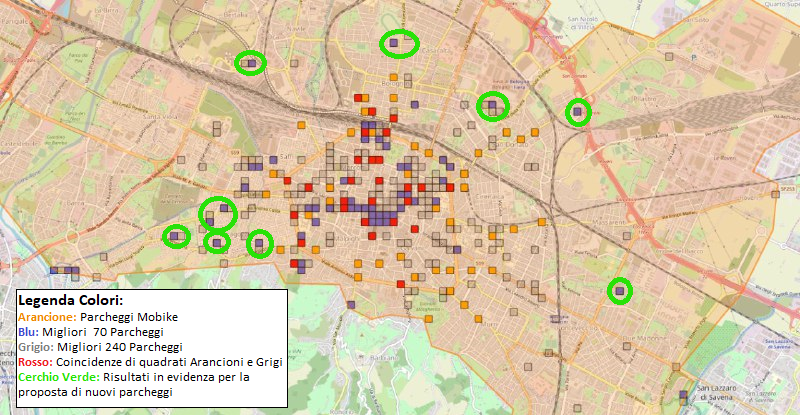

# BikeParkingOptimization

  

**Bike Parking Optimization** was an university project developed during Physics of Complex Systems course at University of Bologna, 
whose goal was studying and improving the existing bike parking spots, offered by [Mobike bike sharing service](https://www.bolognaisfair.it/mobike-bo/) in Bologna urban area. 

The study was done **using bike mobility data** in the city of Bologna, which included urban movement data throughout the day, and the **result** of this study was a list of proposed bike sharing **parking spots**.

## Description
The project consisted in constructing a discrete event simulation that simulated bike movements, 
based on provided realistic mobility data.

Mobility data was first analyzed and processed in order to produce a log of possible movement events (i.e. a bike leaves or reached an area) and a list of traffic information for each city zone (i.e. how many bikes leave or enter a certain area).

This data was then fed to a **discrete event simulation** model that was then used to:
- Distribute a virtual, finite, pool of bikes throughout the city map.
- Simulate bike movement events for a given daily/weekly span based on movements log: a movement could only be carried out if an area had an available bike in it.
- Produce a graphical visualization (3d histogram) of incoming/outgoing traffic by zone.

The simulation allowed us to view how many "realistic" movement events were satisfied, based on the bikes distribution.
Intuitively, the higher the count of satisfied log events, the better was the initial bike placement.

More detailed information can be found in Italian in [project's report](documents/Progetto_Mobike_Fisica_Sistemi_Complessi.pdf).

## Authors

- Michela Lapenna: N/A
- Giordano Paoletti: N/A
- Davide Ravaglia: N/A
- Oleksandr Olmucci Poddubnyy: oleksandr.poddubnyy@studio.unibo.it
